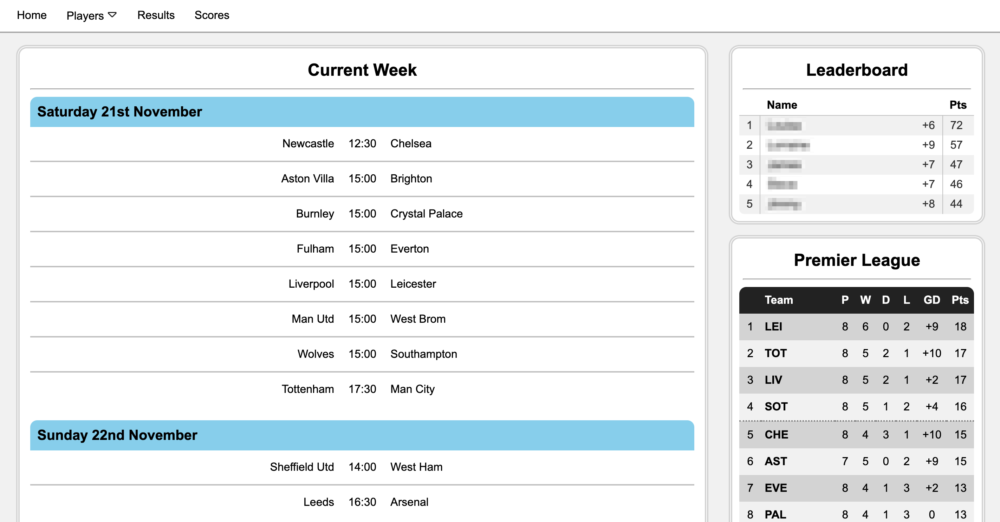
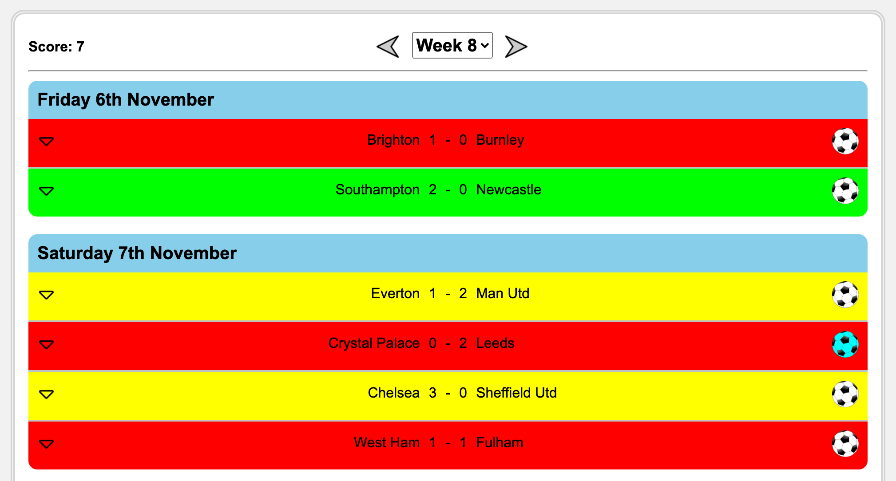
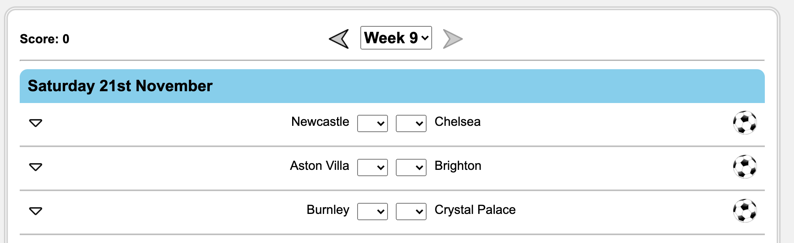
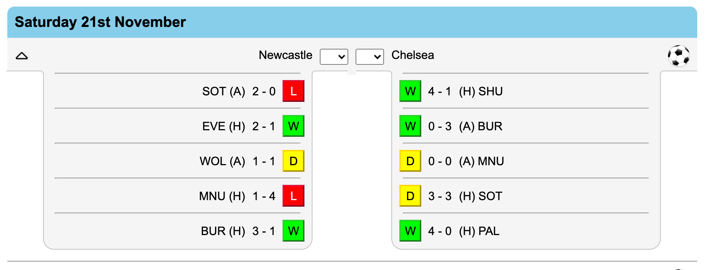
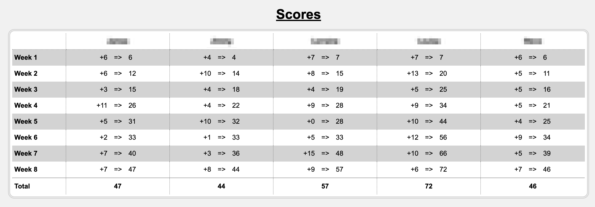
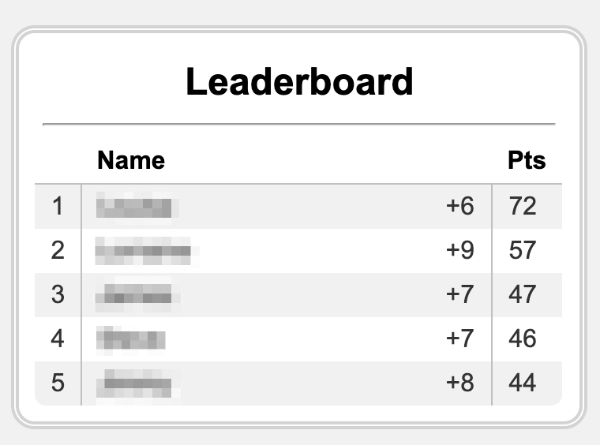

# FootballScores

A website to enter predicted scores for Premier League football games.

## Table of Contents
1. [General Info](#1-general-info)
2. [Technologies](#2-technologies)
3. [Setup](#3-setup)
4. [Features](#4-features)
5. [Status](#5-status)
6. [Inspiration](#6-inspiration)

## 1. General Info
The website allow all players to enter their predicted scores for every game each week.  Points are recieved depending on what the actual result was.  As well, one joker can be played each week and applied to a single game, doubling the points recieved for that individual match.

__Scoring:__
- 3 points if the predicted score matches the actual score
- 1 point point if the predicted score only matches the result
- 0 points point if the predicted score doesn't match the result

## 2. Technologies
- HTML5 & CSS
- PHP
- SQL
- JavaScript

## 3. Setup
Due to this being a private website this code cannot be run fully as the connection to the database has been replaced by an example config file. 

## 4. Features
- Scores can be enter for each match
- Only one joker can be selected per week
- Scoring for each match shown by traffic light system - green is correct score, yellow is correct result, red is incorrect result
- Each match can show and hide both teams recent form
- Leaderboard table displays current ranking and points beside each week's matches
- Full leaderboard displaying every weeks total points
- Current Premier League table displayed beside each week's matches

__Match Score Predicting__

    
    &nbsp; &nbsp; &nbsp;
    

Matches coloured green, yellow or red showing point recieved (left) and entering goals score for each team for every match through the dropdown boxes (right)

 
 

    

The results from both team's last five matches 

 
 

__Leaderboard__

    
    &nbsp; &nbsp; &nbsp;
    

Full leaderboard (left) and mini leaderboard (right)

### To Do
- Temporarily save current scores (e.g. in cookies) while entering results, incase page closed etc.
- Redesign full leaderboard to be more stylish
- Refactor code 
- Fix bug where first day header not shown that specific day

## 5. Status
This project is currenly ongoing.

## 6. Inspiration
The idea for the website was to improve the functionality for myself and my family to play our football score prediction game.  It allows everyone to be able to input, complete and view the games and scores wherever they are, rather than previously where it was all written on paper.  Furthermore, the website makes it easier to store the results and is quicker to enter the next weeks games and automating the scoring.
